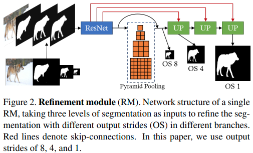
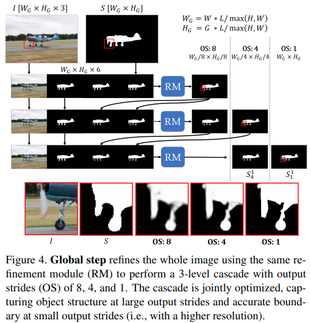
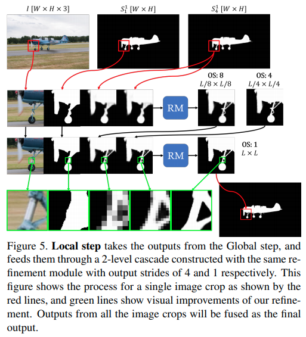
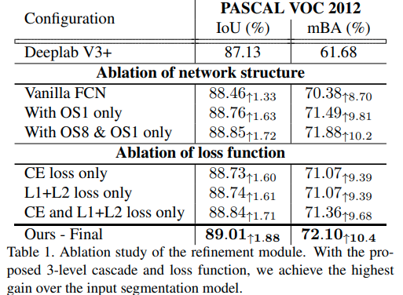
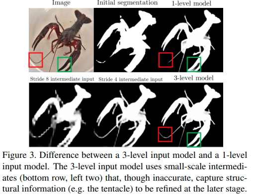
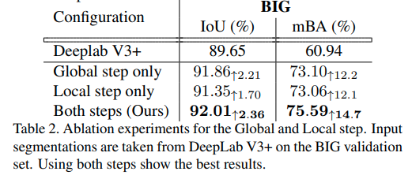
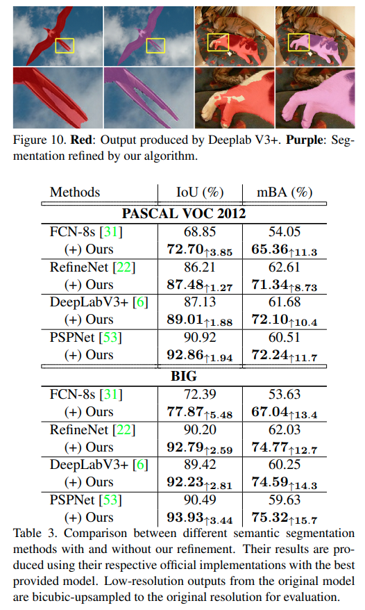
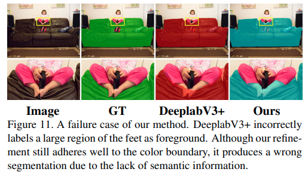
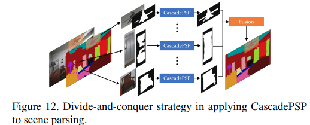
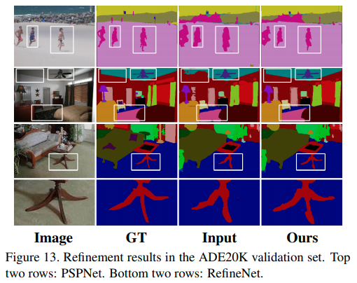

arxivへのリンク  [paper](https://arxiv.org/abs/2005.02551)  
掲載した画像は全て原著論文からの引用

## **どんなもの？**
セグメンテーションのための深層学習手法は学習した解像度と異なる入力に対して適用したとき分割精度が低下する．  
また，4Kを超えるような高解像度画像に対してセグメンテーションを行いたい場合，既存手法はGPUのメモリ量に限界があるため適用できないことがある．  
そこで，入力画像と3つの粗いセグメンテーション画像を用いて，新たにデータセットを学習させる必要なく，セグメンテーションのRefineを行うCascadePSPを提案．  
1枚画像を入力するGlobal Stepで，オブジェクトの構造をとらえ，切り抜き画像を入力とするLocal Stepで細部を処理することで，解像度の依存なくセグメンテーション結果のRefinementが可能．

## **先行研究と比べてどこがすごい？**
データセット，画像解像度に依存することなく，セグメンテーション結果のRefinementができること．Global StepとLocal Stepの合わせ技でGPUメモリの制限に対処できることも魅力．評価のために4K解像度のデータセットも新たに用意し，セグメンテーション結果の構造的な正確性を評価可能なmean Boundary Accuracy measure(mBA)も導入．

## **技術や手法のキモはどこ？**

### Refinement Module(RM)  

入力画像，既存のセグメンテーション手法で事前に得た解像度の異なる3つの粗いセグメンテーション結果を入力してResidual Blockで特徴抽出，その後，カーネルサイズが[1,2,4,6]のPiramid poolingでマルチスケールの特徴を捉える．この時，[1,2,4,8]のストライドで出力を得る．これらに対してUpsamplingで入力に用いたセグメンテーション結果と解像度を揃えてからConcatし，2層の1x1 ConvでRefineする．

### Loss
各スケールのRifine結果に対して異なる損失を定義する
- OS8  
　物体全体の構造を捉えることが重要であるためCross Entropyを用いる
- OS1  
  物体の細部を正確に捉えることが重要であるため，L1+L2 Lossを用いる
- OS4  
  中間的な情報であるため，Cross Entropy + L1+L2 

加えてエッジの正確さを保つため，Sobelフィルタで輝度勾配を計算したgradient lossを導入する

### Global Step
  
画像全体をRMに入力して全体の構造情報を考慮してRefineする．これをPiramid moduleの出力に対応してカスケード式に繰り返す．このとき元画像が4Kなどの高解像度画像だった場合，使用するGPUに応じて入力画像をダウンサンプリングする．

### Local Step
  
画像をクロップしてそれをRMに入力し，細部をRefineする．
このとき，画像境界のアーティファクトを避けるためにクロップの両端16pixを削ったり，ほとんどの画素が4つのクロップをカバーするようにストライドを決める．(意味が理解できていない)

## **どうやって有効だと検証した？**

### Cascade構造とLoss設計の有効性

  
複数の出力を利用したCascade構造，Lossの組み合わせによる効果を示している．  
ザリガニの例では1階の単一処理よりも3階のCascade処理のほうが，精細にRefineできていることがわかる．

### Global StepとLocal Stepの有効性  
  
  両者ともにRefinementの効果はある．Local stepのみを適用した場合にGlobal Stepもよりも精度が悪いのは，物体の構造のRefineができていないため．(粗いRefine ⇒ 細かいRefineが効果的)

### ３つのデータセットで効果検証
- セグメンテーション  
  
  **PASCAL VOC 2012とBIG(Original)**  
  BIGは4K解像度を含む高解像度画像のアノテーションが施された筆者独自のデータセット．解像度は2048×1600 ~ 5000×3600.
  入力解像度の依存なくRefineできている．  

  
  しかし，失敗するケースもあり．

- Scene parsing  
  
  
  "物体らしさ"の情報のみでRefineできるので，シーン解析(Semantic Segmentation）の高精度化にも拡張できる．  
  画像全体に対してSemantic segmentationを行い，物体毎にCascadePSPを適用し，それらの結果をフュージョンする．(Divide-and-conquer strategy)  

## **議論はある？**
入力さらたセグメンテーション画像を元にRifineするため，セグメンテーションが大きく失敗しているようなものではうまくいかない．  
しかし，実用的でSelf-supervisedなどのRefinement moduleとして活用することが見込める．

## **次に読むべき論文は？**
Chi Zhang, Guosheng Lin, Fayao Liu, Rui Yao, and Chunhua
Shen. Canet: Class-agnostic segmentation networks with iterative refinement and attentive few-shot learning. In CVPR, 2019. 2  

Chao Peng, Xiangyu Zhang, Gang Yu, Guiming Luo, and
Jian Sun. Large kernel matters–improve semantic segmentation by global convolutional network. In CVPR, 2017.  

Ning Xu, Brian Price, Scott Cohen, Jimei Yang, and Thomas
Huang. Deep grabcut for object selection. In BMVC, 2017.