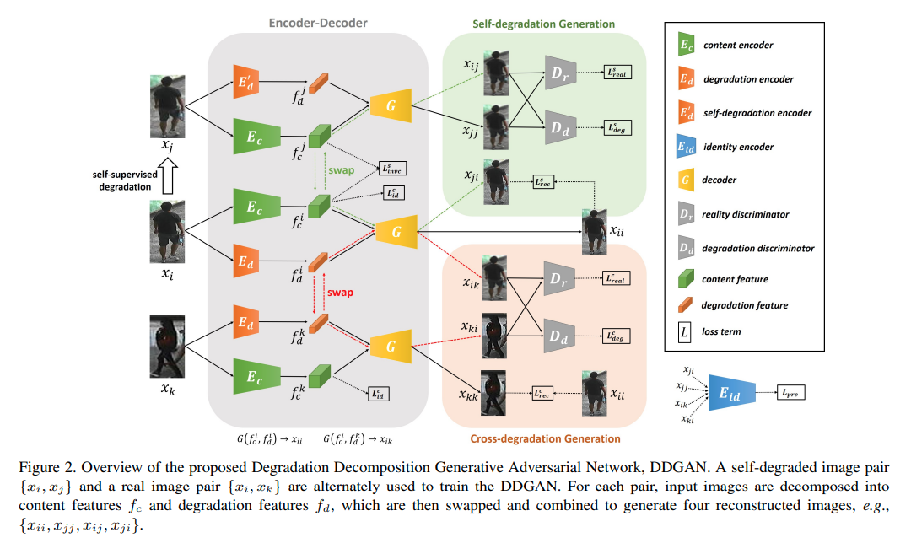
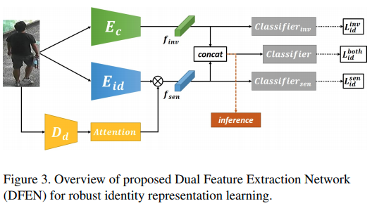
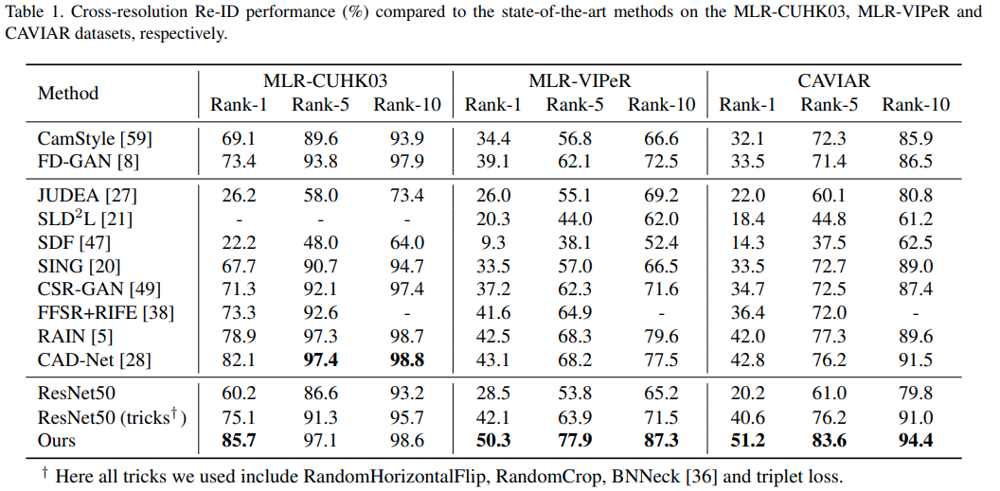
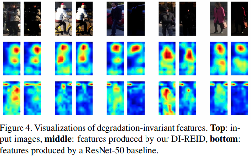
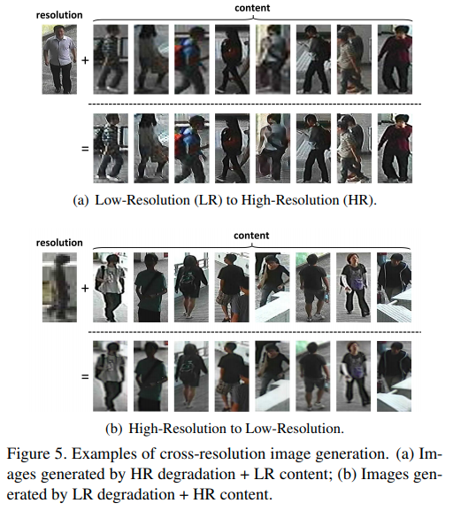
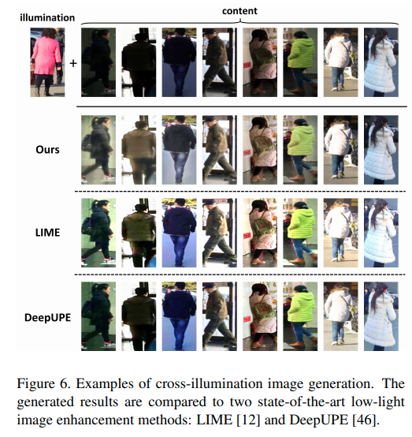
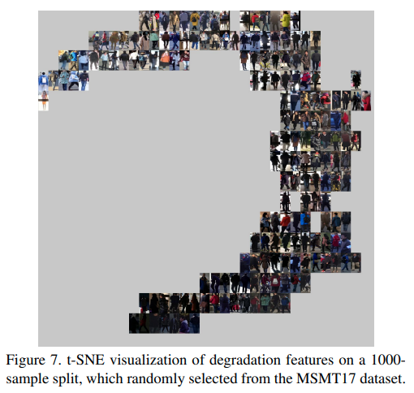

---
# 記事タイトルの設定
title: "Real-world Person Re-Identification via Degradation Invariance Learning"
summary: "Person Re-IDの弊害となる環境変化に対してDisentangle learningを取り入れたGANでEncoderを学習することで対応"
# 記事の説明
description : "Accepted on CVPR2020"
# 作成日付の設定
date: "2020-05-08"
# 更新日
lastmod: "2020-05-08"
#アーカイブの設定を作成日付で設定する
# archives: [2020/05]
# 下書きモード（true=下書き、false=公開）
draft: false
# タグ
tags: ["Disentanglement", "CVPR2020"]
# サムネイルの保存場所を/static/thumbnailにする
# thumbnail: "./img/thumbnail/"
# image: ./thumbnail/DDGAN.png
# 公開終了日付の設定(限定記事以外特に使わない)
images:
- DDGAN.png
# expiryDate: "2020-12-31"
# URLのファイル名部分を変更するパラメータ。基本使わない
# slug: "xxxxx"
# カテゴリ
categories: ["Person Re-ID"]
# 目次設定（true=表示、false=非表示）
toc: true
---

arxivへのリンク  [paper](https://arxiv.org/abs/2004.04933)  
掲載した画像は全て原著論文からの引用

## **どんなもの？**
Person Re-IDのような人物照合タスクは照合データ間で照明，解像度，歩行方向，天候などの変化が生じる場合が多く，これらは認識精度の低下を招く．そこで，そのような変化の影響を受けないような人物特徴(Content特徴)と照合データ間の変動特徴(Degradation特徴)をDisentanglementするようにGANのEncoderを学習する(DDGAN)．次に学習した2つのEncoderとAttention機構を用いて特徴抽出器(DFEN)を学習することで，3つのデータ・セットを用いたCross-resolutionのPerson Re-IDでSoTAを達成．  

## **先行研究と比べてどこがすごい？**
Person Re-IDにDisentangle learningを応用し，認識に必要な人物特徴と悪影響を与える特徴を分離することを可能にしており汎用性が高い．  

## **技術や手法のキモはどこ？**

入力として，通常画像Xi，通常画像を人工的に劣化させた劣化画像Xj，Xiとは別の人物の通常画像Xkを用いて，人物特徴(コンテンツ特徴)をエンコードするEc，劣化特徴を学習するEdとEd'をGANによる画像生成タスクで学習させる(パラメータは共有)．その際，  

- Xiのコンテンツ特徴 ⇔ Xjのコンテンツ特徴
- Xiの劣化特徴 ⇔ Xkの劣化特徴  

をスワップすることで，各エンコーダーが入力の変化の影響を受けない特徴を獲得する(Disentangle)するように制約をかけている．更にDDGANで画像を生成する際，抽出した特徴の組み合わせを変えて画像を生成し，それらを比較する9つの損失関数を導入することで，コンテンツ特徴と劣化特徴の抽出を高精度化しつつ，ドメインGAPが生じないようにしている．  
最後はXi，Xj，Xkに対してEcとEdで抽出した特徴から生成した画像を用いて，劣化の影響を受けにくい特徴抽出器Eidの学習を行う．

Person Re-IDのための特徴抽出器(DFEN)の学習では，DDGANで学習したEcとEidを用いて学習を行う．そのとき，Ecは入力画像の変化に依存しないこと，Eidは入力の劣化具合の変化に応じて感度を変えて特徴抽出することが望ましい．そこで，Eidに対してAttention機構を導入することで調整を可能にしている．

## **どうやって有効だと検証した？**

- 3つのデータ・セットで性能検証しSoTA

- DDGANのEcとResNetの中間層の特徴マップを比較して，提案手法で抽出した特徴は劣化の影響を受けにくいことを確認

- コンテンツ画像から抽出したコンテンツ特徴とリファレンス画像から抽出した劣化特徴を用いて画像生成すると，コンテンツを維持したまま，解像度や照明を変化させた画像を生成でき，Disentangleできていることを確認

- 劣化特徴をt-SNEで2次元平面にプロットすると，劣化に関する教師なし学習であるのにも関わらず，照明具合が分離できていることを確認

## **議論はある？**
論文中には特になし  

以下が今後の課題と予想
- 複数の劣化成分への対応
- コンテンツ特徴の高精度化 or 不変的な特徴の選択(骨格や歩行特徴など)

## **次に読むべき論文は？**
Yu-Jhe Li, Yun-Chun Chen, Yen-Yu Lin, Xiaofei Du, and
Yu-Chiang Frank Wang. *Recover and identify: A generative dual model for cross-resolution person re-identification.*
In The IEEE International Conference on Computer Vision
(ICCV), October 2019