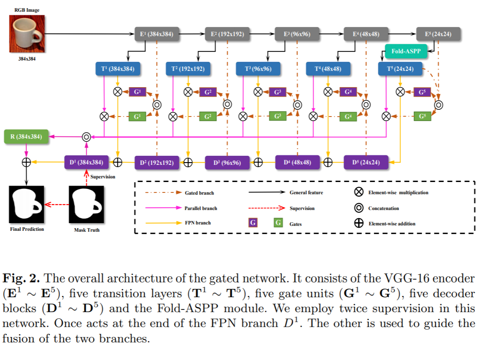
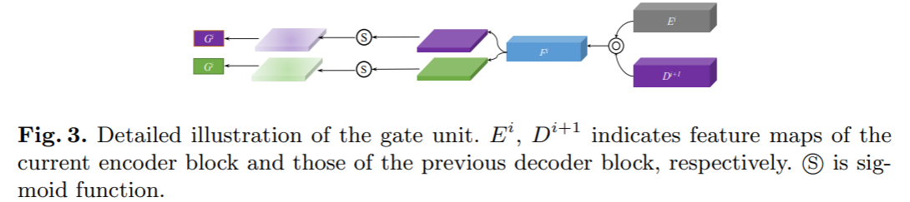
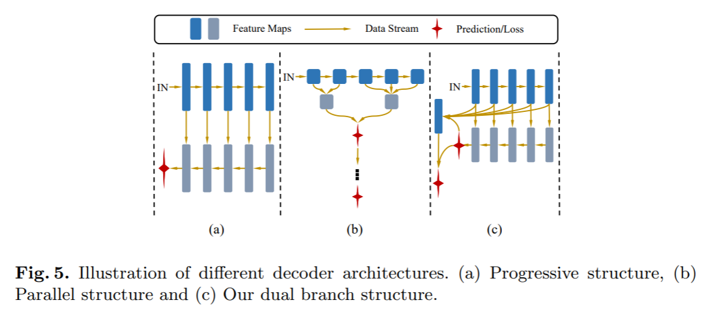
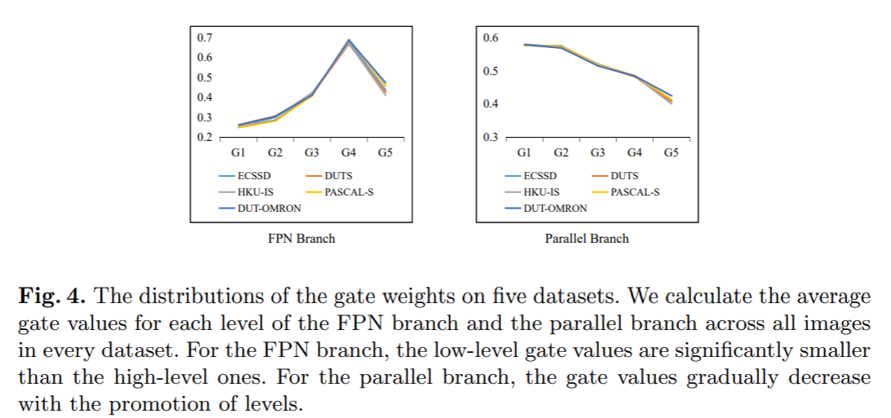
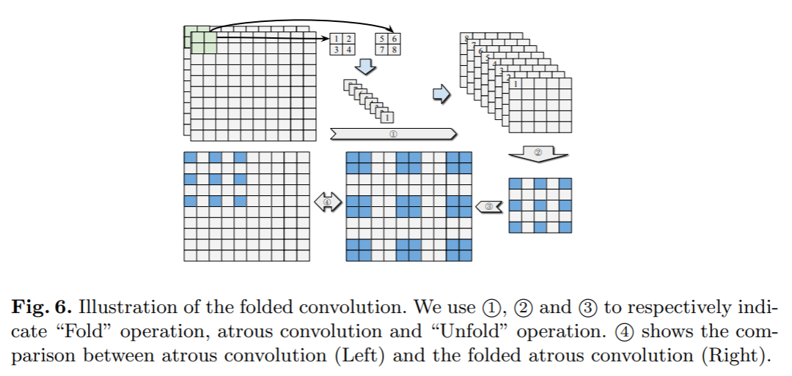
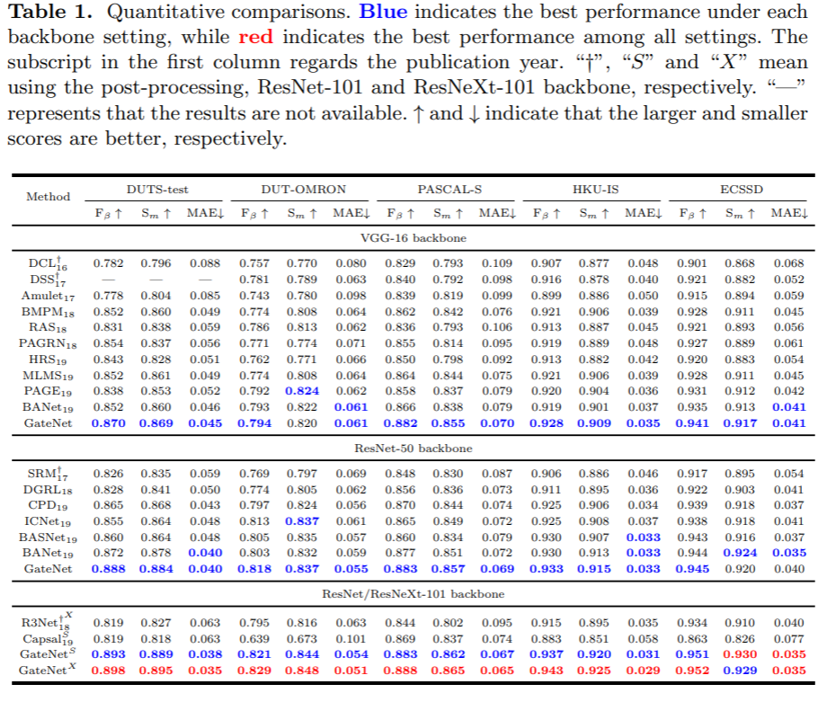
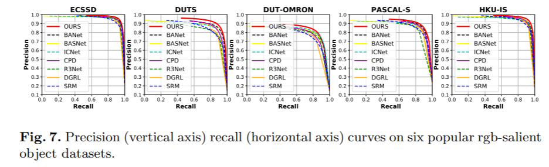
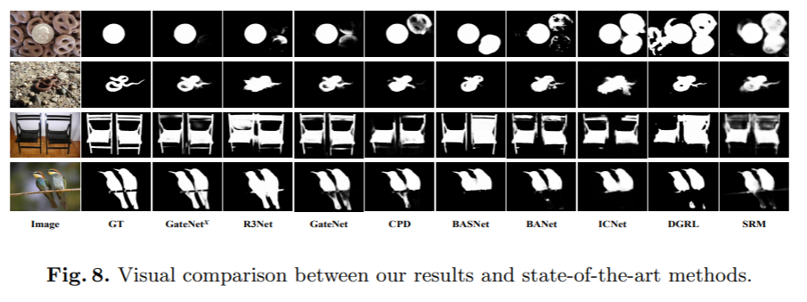
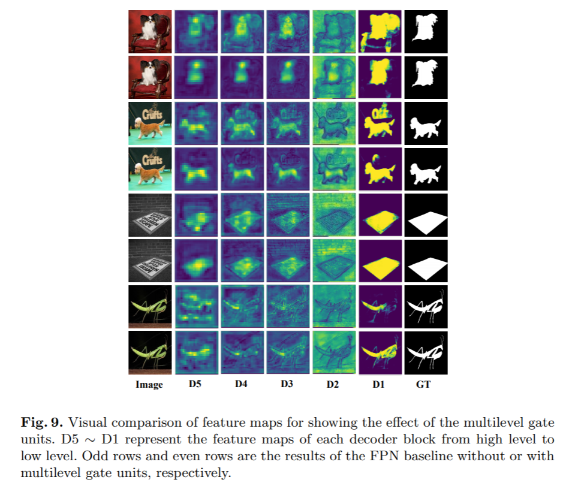
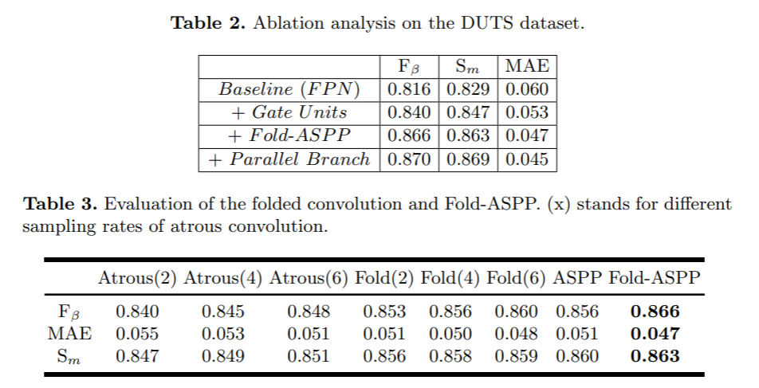

arxivへのリンク  [paper](https://arxiv.org/abs/2007.08074)  
掲載した画像は全て原著論文からの引用

## **どんなもの？**
画像内の注目物体領域推定(SOD：Salient object detection)では，Saliency mapの推定にU-Net，Hourglass Net，FPNなどのU型ネットワークがよく用いられる．それらはEncoderとDecoderをSkip-connectionで接続するが，Encoderからの出力には冗長な情報も含まれるため学習や推論を阻害することが考えられる．例えば，SODの場合，背景と正解領域が似た場合に領域分割精度が低下する傾向にある．  
そこで，バイパス部分にEncoderの出力とDecoderの出力から決定されるGateを導入したGateNetを提案．またマルチスケールの特徴を得るASPPを改良したFold-ASPPを提案．  
DUTSなど主要な5つのデータセットでSoTA．

## **先行研究と比べてどこがすごい？**
従来のU型ネットワークのSkip-connectionは，冗長な情報をDecoderに出力することを指摘し，選択的に処理するGateを導入したこと．また，Gateの情報をうまく利用してRefineするDual branch構造を提案したこと．

## **技術や手法のキモはどこ？**

## GateNet  
  
 
図2のまんま．  
各Encoderの出力とDecoderの出力をチャンネル方向にConcatする．その特徴からConvolutionとSigmoidでAttention mapを生成し，Encoderの出力を変換するTransition layerの出力と要素毎の積をとることでEncoderの出力のうち重要なものを選択する．得られた特徴はDecoderの出力に足されるFPN branchと推論のRefineを行うparallel branchに分かれる．

## Gated dual branch
  
  
- FPN branch  
画像のコンテキスト特徴を主に処理することで，注目物体が画像中のどの物体か推定する役割をもつ．  
- Parallel branch  
物体の構造的特徴を得ることで，領域分割精度を高精度化する役割をもつ．各Gateからの出力はUpsamplingしてからFPN branchの出力とconcatする．その後，その特徴をConvolutionで処理した後，FPN branchと足し合わせてRefineする．

図４は各データセットで，各Gateの重みの平均をとったものであるが，FPN branchではより高次元な特徴に，Parallel branchではより低次元な特徴に大きな重みが与えられていることが分かる．

## Fold-ASPP
  
マルチスケールのDilated Convolutionによって広範囲の特徴抽出を行うASPPはDilation lateが大きくなると，特徴抽出するサンプルが異なりすぎてしまい，特徴抽出が安定しない．  
そこで，空間方向の2x2のパッチをチャンネル方向に並び変えて(="Fold"と呼ぶ)からDilatated Convolutionすることで，実質2x2の範囲をサンプリングすることとなり安定して特徴抽出できる．

## **どうやって有効だと検証した？**
### 推定精度
 
 
 
DUTSをはじめとする主要データセットで5つで検証．
ほぼSoTAを総なめ．推論結果をみても背景が似通ったような画像で領域分割精度が向上していることが分かる．  

### Gateの導入効果
 
Gateなし/Gateありの各Decoderの出力を可視化したとき，Gateありの場合の方がより正解に近い領域を出力できている．

### Fold ASPPの導入効果
 
Dilated Convolution，ASPPにおいて，Fold-ASPPで提案した"Fold"処理を行う効果を検証．全てにおいてFold-ASPPが有効に働いている．

### 各モジュールの導入効果
Gate，Fold-ASPP，Parallel-branchを順に加えることで，徐々に精度が高まることを確認．GateとFold-ASPPの寄与が大きい．

## **議論はある？**
Gateを導入したU型ネットワークはDenseな推定を必要とするタスクに適している．

# 次に読むべき論文は？
Pang, Y., Zhao, X., Zhang, L., Lu, H.: Multi-scale interactive network for salient object detection. In: Proceedings of IEEE Conference on Computer Vision and Pattern Recognition. pp. 9413–9422 (2020) 
