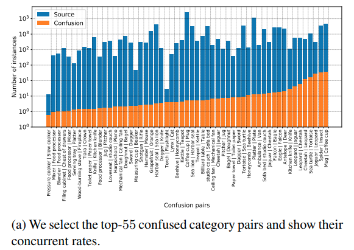
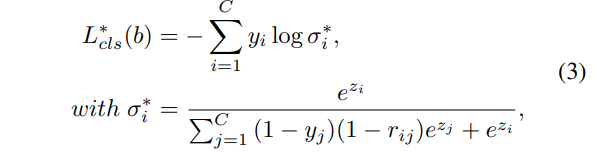
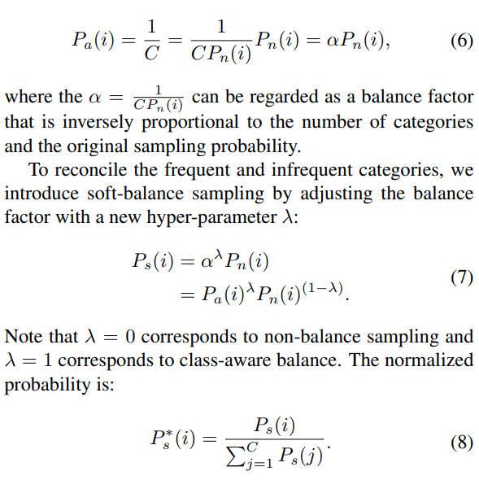
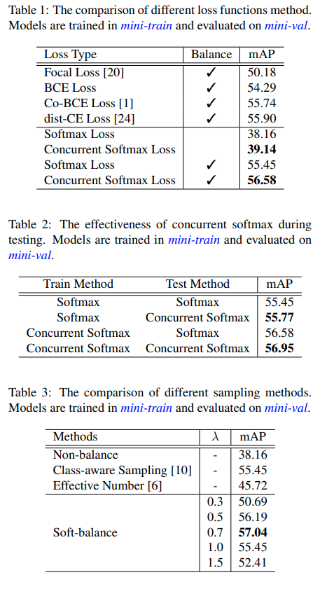
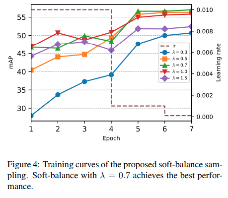
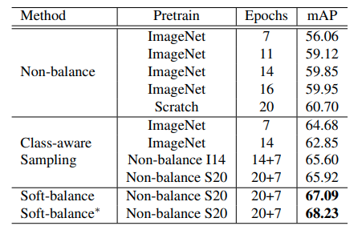
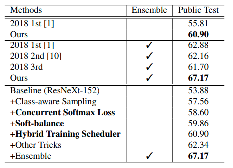

---
# 記事タイトルの設定
title: "Large-Scale Object Detection in the Wild
from Imbalanced Multi-Labels"
summary: "大規模画像データ・セットがもつラベルのミスや不均衡の問題に対して，Softmax関数の修正と新たなサンプリング戦略で対応"
# 記事の説明
description : "Accepted CVPR2020"
# 作成日付の設定
date: "2020-05-25"
# 更新日
lastmod: "2020-05-25"
#アーカイブの設定を作成日付で設定する
# archives: [2020/05]
# 下書きモード（true=下書き、false=公開）
draft: false
# タグ
tags: ["Imbalanced labels", "Open Images Dataset", "CVPR2020"]
# サムネイルの保存場所を/static/thumbnailにする
# thumbnail: "./img/thumbnail/"
# 公開終了日付の設定(限定記事以外特に使わない)
# expiryDate: "2020-12-31"
# URLのファイル名部分を変更するパラメータ。基本使わない
# slug: "xxxxx"
# カテゴリ
categories: ["Object detection"]
# 目次設定（true=表示、false=非表示）
toc: true
---

arxivへのリンク  [paper](https://arxiv.org/abs/2005.08455)  
掲載した画像は全て原著論文からの引用

## **どんなもの？**
深層学習はデータセットの規模に大きく影響を受ける．しかしOpen Imagesのような大規模データ・セットはアノテーターの認知能力の差異に基づくアノテーションミス(i.e. おもちゃの車：おもちゃ，車)や，カテゴリー間の極端なデータの不均衡が起こり得る．  
そこで，誤って付与された複数の正解ラベルに対して影響を受けないようにSoftmax関数を修正することでアノテーションミスに対応した．  更に，バランスの調整具合を決める任意パラメータを導入した提案手法のSoft-balance sampling，カテゴリー内のサンプル数によって調整される従来手法のどちらを適用するかを学習時にスケジューリングすることでデータの不均衡に対応．

## **先行研究と比べてどこがすごい？**
従来のOpen Imagesを利用した物体検出の学習では，不正確なラベルが複数つけられていたとしても考慮せず，単一のラベルのみを用いて学習を行っていた．(詳しくは分からない)  
提案手法では複数の正解ラベルを考慮してscoreを計算，損失を求めるため，誤った学習を行うことが抑制される．  
また，データ不均衡に対して，カテゴリー内のサンプル数に応じてサンプリングを変える従来手法は，データセットの大部分が参照されなかったり，一部のデータだけ参照されすぎることが考えられ，学習を非効率的にする可能性があったが，soft-balance samplingとハイブリッドスケジューリングによって影響を緩和できる．

## **技術や手法のキモはどこ？**
### Concurrent Softmax

(1 - yi)項：正解ラベルが複数あるとき，モデルの出力したクラスの応答と対応したカテゴリーしか考慮しない．  
(i番目の応答ならばj=i以外に正解ラベルがあっても考慮しない．)  

(1 - rij)項：不正解ラベルは，誤ったラベルである割合を考慮して調整．rijは全ラベルの分布から求める．  

### Soft-balance Sampling with Hybrid Training

サンプリング方法として
- 学習するカテゴリーの総画像枚数/ 総画像枚数 = 1 / P
- 1 / 全てのカテゴリー数 = 1/ C  
の２つが考えられる．  
これをパラメータλで操作できるようにしたものがSoft-balance sampling
学習では各epock毎にλを設定することで頻出しないカテゴリーの学習を進めたり，反対に極端に過学習しないように
調整する．

## **どうやって有効だと検証した？**
各手法について，個別に検証．

## **議論はある？**
特になし
CVPR2020 Oralだけあって，とてもシンプルながら実応用に向いている．  
複数ラベルが混在してしまうのが，Open Imagesの特性なのか，一般的にそうなる傾向があるのか把握できていない．

## **次に読むべき論文は？**
物体検出の基礎のFast R-CNNからさらっていく