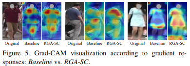

---
# 記事タイトルの設定
title: "Relation-Aware Global Attention for Person Re-identification"
summary: "物体構造の関係性を考慮して重み付けするRelation-aware Global Attentionを提案"
# 記事の説明
description : "Acceped CVPR2020"
# 作成日付の設定
date: "2020-05-15"
# 更新日
lastmod: "2020-05-15"
#アーカイブの設定を作成日付で設定する
# archives: [2020/05]
# 下書きモード（true=下書き、false=公開）
draft: false
# タグ
tags: ["Attention", "CVPR2020"]
# サムネイルの保存場所を/static/thumbnailにする
# thumbnail: "./img/thumbnail/"
# 公開終了日付の設定(限定記事以外特に使わない)
# expiryDate: "2020-12-31"
# URLのファイル名部分を変更するパラメータ。基本使わない
# slug: "xxxxx"
# カテゴリ
categories: ["Person Re-ID"]
# 目次設定（true=表示、false=非表示）
toc: true
---

arxivへのリンク  [paper](https://arxiv.org/abs/1904.02998)  
掲載した画像は全て原著論文からの引用

## **どんなもの？**
Attention機構は特徴ベクトルの重要度を決めるとき，Targetの特徴のみで重要度を計算するLocal-Attentionと，全ての特徴を用いてTargetの重要度を計算するGlobal-Attention(Non-local Attention)に大別できる．  
前者は受容野に制限があるため特徴マップの大局的な情報(i.e. 腕"全体")を考慮できず，後者は大局的な情報を考慮できるが位置情報が欠落するため，物体構造の関係性(i.e. Tシャツと靴の組み合わせ)を考慮できない.  
そこで，重要度を決めるTargetの特徴ベクトルと，その他の特徴ベクトルの関係性を計算するRelation-aware Global Attention(RGA)を提案．Person Re-IDと相性がよく3つのデータ・セットにおいてSoTA．

## **先行研究と比べてどこがすごい？**
7x7の大きなカーネルを用いるAttention機構であるCBAMでも捉えることができない構造関係(i.e. 右手：ペットボトル，左手：手ぶら)を踏まえて特徴抽出が可能．
また，Global Attentionは特徴マップ間でAttentionに差が生まれにくいが，RGAの特徴マップは多様になる．

## **技術や手法のキモはどこ？**

特徴間の関係性を捉えるために，重要度を決めるTargetとなる特徴とその他の特徴のペアを変えてRelation特徴を算出する．その後Targetの特徴とRelation特徴の結合し，Targetの重要度を重み付けする.

Spatial AttentionであるRGA-S，Channel AttentionであるRGA-Cを提案．  
RGA-SはCxHxWの特徴マップのうち，チャンネル方向の特徴をひとまとめとして扱い，N=0...(HxW)までのindexとする．基準となるi番目の要素(1x1xC)とj番目の要素(1x1xC)をそれぞれ，1x1 Conv(θ，Φ)で変換(1x1x{C/r})して内積を計算する．  
この処理を全てのi,jの組み合わせで行いNxNのAffinity matrixをつくる．  
[参考：Affinity_matrix](https://qiita.com/pacifinapacific/items/2e7a03aa84d8a8bfa60d)  
生成したAffinity matrixを行，列毎に分解しHxWのRelation特徴とする．  
Relation特徴と変換前の特徴はドメインが異なる情報をもつため，Global Average Poolingと1x1 Convで変換し次元削減する．その後にそれらを結合し，1x1 Conv(W1,W1)によってAttntionを生成する．  
同様にRGA-Cも計算できる．

## **どうやって有効だと検証した？**

RGA-S，RGA-CをResNet50のResidual Blockの後に挿入し効果を検証．  
RGA-SとRGA-Cのどちらも使う場合は順番に適用(RGA-CS, RGA-SC)，並列に処理(RGA-S//C)を検証．
　

Local,Global Attentionと比較．構造の関係を考慮したRGAが凌駕．

Global Attention(Non-local)はTarget(赤点)の位置が変わっても強く重みづけされる領域が変化しないが，RGA-Sは服，持ち物など関係のある領域に強く重みづけされる．

Local Attentionと比較すると保持するパラメータ数は増えるが，Global Attentionよりは少なくていい．  
Affinity matrixを生成するとき1x1 Convでembeddingする効果があるか検証．  
別々の重みをもつ2つの1x1 Convを利用したほうがよい(Asymmetric)
(誤解釈があるかもしれない)

SoTAと比較．2019年に提案された手法を大きく凌駕．

Grad-CAMにより認識に寄与した領域を可視化すると，人の直感に沿った領域に強く反応していることがわかる．

## **議論はある？**
ResNetの場合，各ブロックにRGA-SCに挿入したほうがよい．

## **次に読むべき論文は？**
Yue Cao, Jiarui Xu, Stephen Lin, Fangyun Wei, and Han
Hu. Gcnet: *Non-local networks meet squeeze-excitation networks and beyond.* arXiv preprint arXiv:1904.11492, 2019.