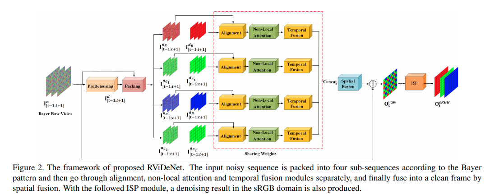
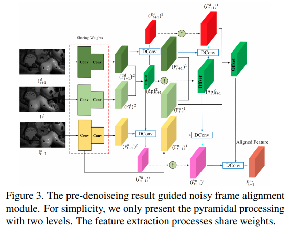
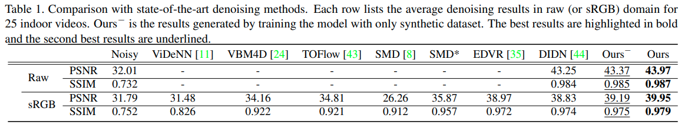
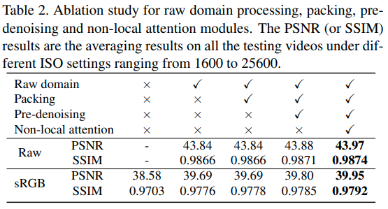
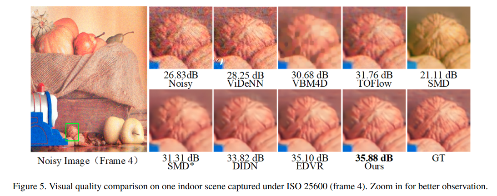
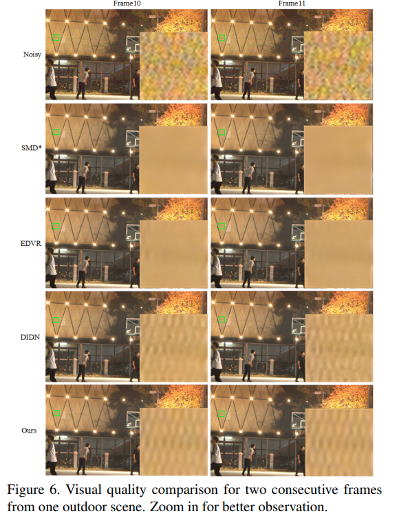

---
# 記事タイトルの設定
title: "Supervised Raw Video Denoising with a Benchmark Dataset on Dynamic Scenes"
summary: "おもちゃを使ったRaw video datasetを利用したRaw video denoising network(RViDeNet)の提案"
# 記事の説明
description : "Accepted on CVPR2020"
# 作成日付の設定
date: "2020-05-11"
# 更新日
lastmod: "2020-05-11"
#アーカイブの設定を作成日付で設定する
# archives: [2020/05]
# 下書きモード（true=下書き、false=公開）
draft: false
# タグ
tags: ["Video Denoising", "Dataset"]
# サムネイルの保存場所を/static/thumbnailにする
# thumbnail: "./img/thumbnail/"
# 公開終了日付の設定(限定記事以外特に使わない)
# expiryDate: "2020-12-31"
# URLのファイル名部分を変更するパラメータ。基本使わない
# slug: "xxxxx"
# カテゴリ
categories: ["Denoising"]
# 目次設定（true=表示、false=非表示）
toc: true
---

arxivへのリンク  [paper](https://arxiv.org/abs/2003.14013)  
掲載した画像は全て原著論文からの引用

## **どんなもの？**
今まではsRGB画像でノイズ除去が行われていたが，sRGB画像はホワイトバランスやガンマ補正などの非線形変換を行うため，ノイズ分布が複雑になり推定が難しい．近年はデモザイクする前のRAWデータをノイズ除去に用いることが注目され，研究が活発化している．  
RAWデータを用いたデータ・セットはいくつか提案されているが，ノイズ画像とクリーン画像のペア作るには長露出で撮影する必要があり，動体がある状況では撮影が難しい．  
そこでおもちゃを利用し物体の動きを再現した新たなRAWデータ・セットを作成．いくつかの従来手法を取り入れたRViDeNetを構築し，従来のSoTAの手法と独自データ・セットで比較し最も良い精度を達成．  

## **先行研究と比べてどこがすごい？**
様々な手法を組み合わせてSoTAの精度を達成していること．  
データ・セットにおもちゃを利用して作成した点はおもしろいが，動画のためのRAWデータの撮影システムは提案されており，やや新規性は弱まる．（論文ではおそらく意図的に参照されていない．)

## **技術や手法のキモはどこ？**

U-Netを用いたPre-denoisingの後に隣接フレームを利用した3層のPiramid deformable Conv， non-local attention機構を利用し，pre-denoisingによって平滑化されたエッジの推定を高度化していること

### Alignment

ノイズ除去を行いたいフレームtの一つ前のフレームt+1の，pre-denoiseデータとnoiseデータを利用してConv層で特徴抽出する．  
その後，畳み込みフィルタの幾何的な制約を緩和するDeformable convを3層のpiramid構造をカスケード接続して適用することで広範囲の受容野をカバーしたピクセルのアライメントを行う．  

### non-local attention

Spatial，Channel，Temporalの方向に1つのピクセルに対して，全てのピクセルを考慮して重み付けするnon-local attention機構を適応する．これによって，更に広範囲のアライメントが可能になる． 

### Temporal fusionとSpatial fusion
従来手法であるelement-wise temporal fusion strategyで時間方向の統合(出力は1xCxHxH)を行い，10層のResNetにCBAMという特徴表現拡張機構を導入したネットワークで空間方向の統合を行う(出力は4xHxW)．

## **どうやって有効だと検証した？**

独自データ・セットを用いてSoTAの手法と比較．ViDeNNは学習コードが再現できなかったため，公開された学習済みモデルを直接利用． 

各ステージを段階的に加えた場合の性能変化を比較．徐々に性能が向上している．

ノイズ除去画像の比較  
比較的エッジが残せている

## **議論はある？**
特になし．  
高精度化するために徐々にネットワークの構造が複雑化し，その分計算量も増えるため，処理速度を考慮した高速な手法が今後求められる．

## **次に読むべき論文は？**
- Matias Tassano, Julie Delon, and Thomas Veit. *Fastdvdnet: Towards real-time video denoising without explicit motion estimation.* arXiv preprint arXiv:1907.01361, 2019.

- Jifeng Dai, Haozhi Qi, Yuwen Xiong, Yi Li, Guodong Zhang, Han Hu, and Yichen Wei. *Deformable convolutional networks.* In Proceedings of the IEEE international conference on computer vision, pages 764–773, 2017.

- Jun Fu, Jing Liu, Haijie Tian, Yong Li, Yongjun Bao, Zhiwei Fang, and Hanqing Lu. *Dual attention network for scene segmentation.* In Proceedings of the IEEE Conference on Computer Vision and Pattern Recognition, pages 3146–3154, 2019. 

- Haiyang Jiang and Yinqiang Zheng. *Learning to see moving objects in the dark.* In The IEEE International Conference on Computer Vision (ICCV), October 2019.